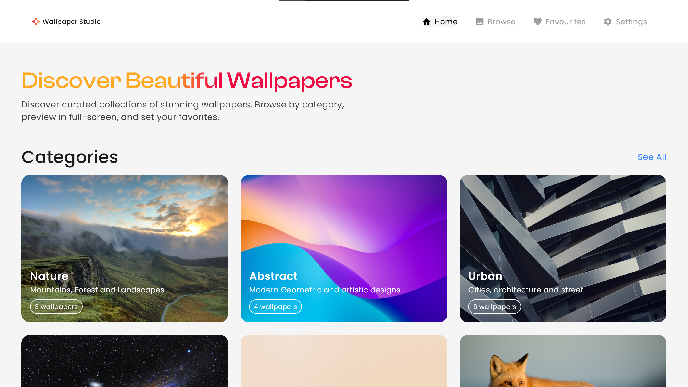

# Wallpaper Studio (wallpaper_selector)

A modern Flutter desktop & mobile app to browse, preview, and set wallpapers. It provides curated wallpaper categories, previews, and a flexible settings panel to configure wallpaper display and behavior.



## Features

- Browse curated wallpaper categories (Grid / List view).
- Preview wallpapers with tags and details.
- Wallpaper setup panel with display modes, auto-rotation, and advanced options.
- Save favorites and quick actions (share, compare, settings).
- Responsive layout for desktop and mobile widths.

## Project structure

- `lib/`
	- `main.dart` — app entrypoint.
	- `screens/` — pages: `home.dart`, `browse_page.dart`, `category_details.dart`, `settings.dart`, etc.
	- `widgets/` — reusable UI components: `category_card.dart`, `shared_header.dart`, `tags.dart`, etc.
	- `data/` — sample data (categories).
	- `models/` — data models.

Other platform directories are included for building (windows/, macos/, linux/, ios/, android/, web/).

## Getting started (Windows / PowerShell)

1. Ensure you have Flutter installed and configured for your desired platforms. See https://flutter.dev for setup instructions.

2. From the project root, fetch dependencies:

```pwsh
flutter pub get
```

3. Run the app (Windows desktop):

```pwsh
flutter run -d windows
```

Or run on other targets, for example Chrome (web):

```pwsh
flutter run -d chrome
```

## Notes for development

- The main `Scaffold` and header are implemented in `lib/screens/home.dart` and `lib/widgets/shared_header.dart`. Child screens return content that is placed inside the main scaffold — avoid nesting `Scaffold` widgets in the body unless you intentionally want a separate route-level scaffold.

- Navigation to `CategoryDetailsPage` should use the normal navigator (e.g. `Navigator.of(context).push(...)`) so routes compose correctly with the parent `Scaffold`.

- The `settings.dart` screen contains `WallpaperSetupCard` (dropdown + switch + action buttons). Persist settings using `shared_preferences` or another store if you want values to survive app restarts.

## Dependencies (high-level)

This project uses (see `pubspec.yaml` for exact versions):

- `flutter`
- `google_fonts`
- `flutter_svg`

## Tests

There is a basic widget test in `test/widget_test.dart`. Run tests with:

```pwsh
flutter test
```

## Contributing

1. Fork the repo.
2. Create a feature branch: `git checkout -b feature/my-change`.
3. Implement changes and add tests where appropriate.
4. Open a pull request against `master`.

## License

This project is provided under the MIT license. See `LICENSE` for details (if you want me to add one I can create a `LICENSE` file).

---

If you'd like, I can:

- Add a `LICENSE` file (MIT) and a brief contributing guide.
- Wire `shared_preferences` to persist the settings in `settings.dart`.
- Run `flutter analyze` and fix any remaining lints.

Which of those should I do next?
